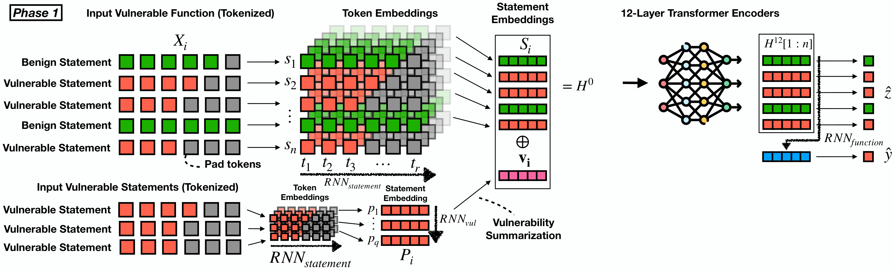
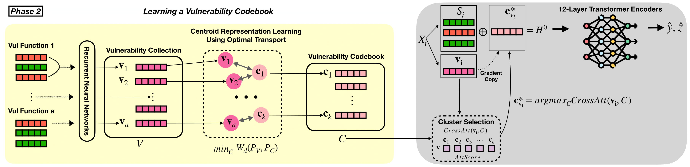

<div align="center">
  
# *OPTIMATCH* <br> Learning to Quantize Vulnerability Patterns and Match to Locate Statement-Level Vulnerabilities <br> (Reproduction of Experiments)
  
</div>





<p align="center">
  </a>
  <h3 align="center">OPTIMATCH</h3>
  <p align="center">
    Learning to Quantize Vulnerability Patterns and Match to Locate Statement-Level Vulnerabilities
  </p>
</p>
     
## Table of contents

<!-- Table of contents -->
<details open="open">
  <summary></summary>
  <ol>
    <li>
      <a href="#how-to-reproduce">How to reproduce</a>
        <ul>
          <li><a href="#environment-setup">Environment Setup</a></li>
          <li><a href="#reproduction-of-experiments">Reproduction of Experiments</a></li>
        </ul>
    </li>
    <li>
      <a href="#license">License</a>
    </li>
    <li>
      <a href="#citation">Citation</a>
    </li>
  </ol>
</details>

## How to reproduce 

### Environment Setup
<details open="open">
  <summary></summary>
  
First of all, clone this repository to your local machine and access the main dir via the following command:
```
git clone https://github.com/optimatch/optimatch.git
cd optimatch
```

Then, install the python dependencies via the following command:
```
pip install -r requirements.txt
```

* We highly recommend you check out this <a href="https://pytorch.org/">installation guide</a> for the "torch" library so you can install the appropriate version on your device.
  
* To utilize GPU (optional), you also need to install the CUDA library, you may want to check out this <a href="https://docs.nvidia.com/cuda/cuda-quick-start-guide/index.html">installation guide</a>.
  
* <a href="https://www.python.org/downloads/release/python-397/">Python 3.9.7</a> is recommended, which has been fully tested without issues.
 
</details>
 
### Reproduction of Experiments
  
  <details open="open">
    <summary></summary>
    
  Download necessary data and unzip via the following command: 
  ```
  cd data
  sh download_data.sh 
  cd ..
  ```
  
  </details>  
  
  <details open="open">
    <summary></summary>
  
  #### Reproduce Main Results (Table 1 in the paper)
  - OPTIMATCH (proposed approach)
    * Inference
    ```
    cd our_method/optimatch/saved_models/checkpoint-best-f1
    sh download_models.sh
    cd ../..
    sh test_phase_2_150pat.sh
    cd ..
    ```
    * Retrain Phase 1 Model
    ```
    cd our_method/optimatch
    sh train_phase_1.sh
    cd ..
    ```
    * Retrain Phase 2 Model
    ```
    cd our_method/optimatch
    sh train_phase_2_150pat.sh
    cd ..
    ```
 - Baselines
  
   To reproduce baseline approaches, please follow the instructions below:

   * Step 1: cd to "./baselines" folder
   * Step 2: cd to the specific baseline folder you wish to reproduce, e.g., "statement_codebert"
   * Step 3: cd to the models folder, e.g., "saved_models/checkpoint-best-f1"
   * Step 4: download the models via "sh download_models.sh" and "cd ../.."
   * Step 5: find the shell script named as "train_xyz.sh" (e.g., train_multi_task_baseline_codebert.sh) and run it via "sh train_xyz.sh"

   **To run inference, find the shell script named as "test_xyz.sh" and run it via "sh test_xyz.sh", <br> If "test_xyz.sh" does not exist, remove "do_test" command in "train_xyz.sh" and run the inference via "sh train_xyz.sh"**

   A concrete example is provided as follows:

   - Statement-Level CodeBERT
      * Retrain
      ```
      cd baselines/statement_codebert/saved_models/checkpoint-best-f1
      sh download_models.sh
      cd ../..
      sh train_multi_task_baseline_codebert.sh
      cd ../..
      ```
  
  </details>
 
  <details open="open">
    <summary></summary>
    
  #### Reproduce Ablation Study (Table 2 in the paper)
  - To reproduce **w/o vulnerability codebook & matching**, run the following commands:
    * Retrain (ignore "sh train_phase_one.sh" if running inference only)
      ```
      cd our_method/optimatch/saved_models/checkpoint-best-f1
      sh download_models.sh
      cd ../..
      sh train_phase_one.sh
      sh test_phase_one.sh
      cd ../..
      ```
  
  Each ablation trial (except **w/o vulnerability codebook & matching**) consists of phase 1 and 2 trainings like our OPTIMATCH approach.
  First cd to the folder contains your interested trial.
  To retrain models in any phases, run "train_xyz.sh".
  To run inference in any phases, run "test_xyz.sh".
  
  - To reproduce **w/o RNN embedding (mean pooling applied)**, cd to "./ablation/token_embedding_pooling_mean"
  - To reproduce **w/o RNN embedding (mean pooling applied)**, cd to "./ablation/token_embedding_pooling_max"
  - To reproduce **OPTIMATCH wt N vulnerability centroids**, cd to "./ablation/num_patterns"
  
  </details>
     
## License 
<a href="https://github.com/optimatch/optimatch/blob/main/LICENSE">MIT License</a>

## Citation
```bash
under review at ICML 2024
```
